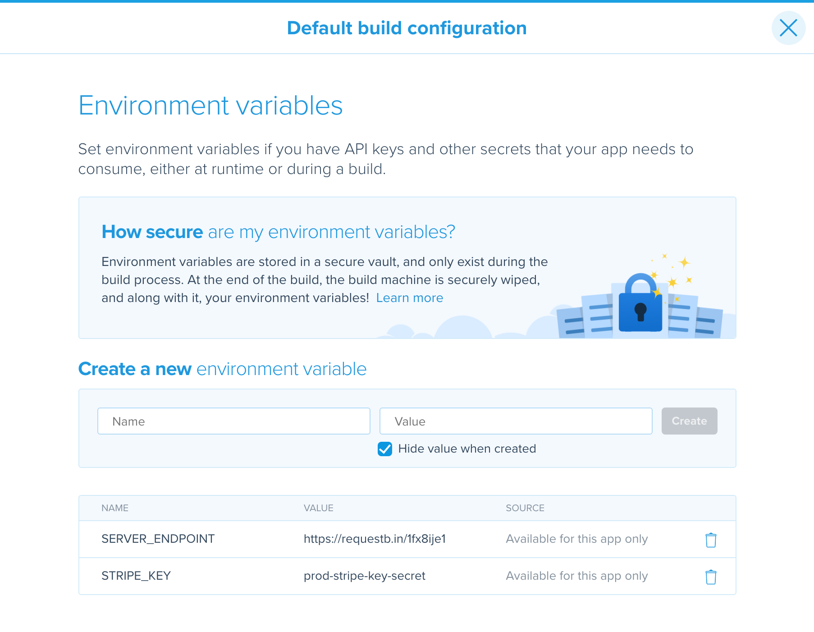

# MultipleEnvExample

1. We have a `Config.swift` file which retrieves the values from the `Info.plist` or use the default values
2. Then, we have a [Custom Postclone step](buddybuild_postclone.sh) from which we inject values into the `Info.plist`
3. Finally, from the dashboard we add a couple of environment variables

## Default (production) environment keys

## Override in the develop branch

## Override in both develop and preprod branch

# Additional infos: 

* Setting up env var in buddybuild - [link](http://docs.buddybuild.com/docs/environment-variables)
* Custom build steps - [link](docs.buddybuild.com/docs/custom-prebuild-and-postbuild-steps)
* Custom build steps examples - [link](https://www.buddybuild.com/blog/customizing-the-build-process)
